# Siplytics ☕

### The Team Behind the App

### Team Name: Kannur Squad

### Team Members

* Team Lead: [ASI] Fariz Aiden S - KMEA
* Member 1: [CPO] Pavan K T - KMEA

---

## Project Description

Siplytics is an advanced AI-powered tea analysis platform designed to solve problems that humanity never had. Using computer vision and completely unnecessary analytics, Siplytics analyzes your cup of tea and provides highly questionable insights into its quality, concentration, froth, color, and overall tea superiority.

Because apparently, drinking tea wasn't complicated enough.

## The Problem (That Doesn't Exist)

Millions of people drink tea every day without knowing its exact color concentration, bubble density, froth quality, or whether their tea deserves to be consumed.

This lack of useless tea intelligence is a serious global crisis.

Traditional tea analysis methods require laboratories, expensive equipment, and trained professionals. Siplytics eliminates all of that by allowing anyone to upload a photo of their tea and spitting out VERY USEFUL information
## The Solution (That Nobody Asked For)

Siplytics uses computer vision to analyze uploaded images of tea and generate pointless but entertaining insights.

The application evaluates:

* Tea Color Intensity
* Estimated Tea Concentration
* Froth and Bubble Density
* Surface Texture
* Overall Tea Vibes
* British Certification Level
* Drinkability Score
* Randomly Generated Tea Verdicts

At the end of the analysis, users receive an official verdict ranging from:

> "This tea is Certified."

to:

> "Bro, this tea is shit. Throw it out."

All analysis is performed with advanced technology for absolutely no practical reason.

---


# Technical Details

## Technologies/Components Used

### For Software:

* **Languages Used**

  * Python
  * HTML
  * CSS
  * JavaScript

* **Frameworks Used**

  * Flask

* **Libraries Used**

  * OpenCV
  * NumPy
  * Werkzeug

* **Tools Used**

  * Visual Studio Code
  * Git & GitHub
  * Python 3.12.0
  * Web Browser (Brave)

### For Hardware:

No specialized hardware required.

Siplytics runs entirely through a standard computer or mobile browser using image uploads.

---

## Implementation

### For Software:

#### Installation

Clone the repository:

```bash
git clone https://github.com/Reevesz/Siplytics.git
cd siplytics
```

Create a virtual environment:

```bash
python -m venv venv
```

Activate the virtual environment on Windows:

```bash
venv\Scripts\activate
```

Install dependencies:

```bash
pip install -r requirements.txt
```

#### Run

Start the Flask application:

```bash
python app.py
```

Open your browser and navigate to:

```text
http://127.0.0.1:5000
```

Upload an image of your tea and let Siplytics judge your beverage choices.

---

# Project Documentation

## Project Preview

### Landing Page

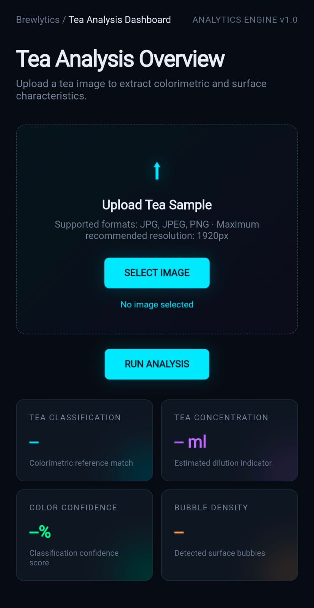

### Photo to be uploaded

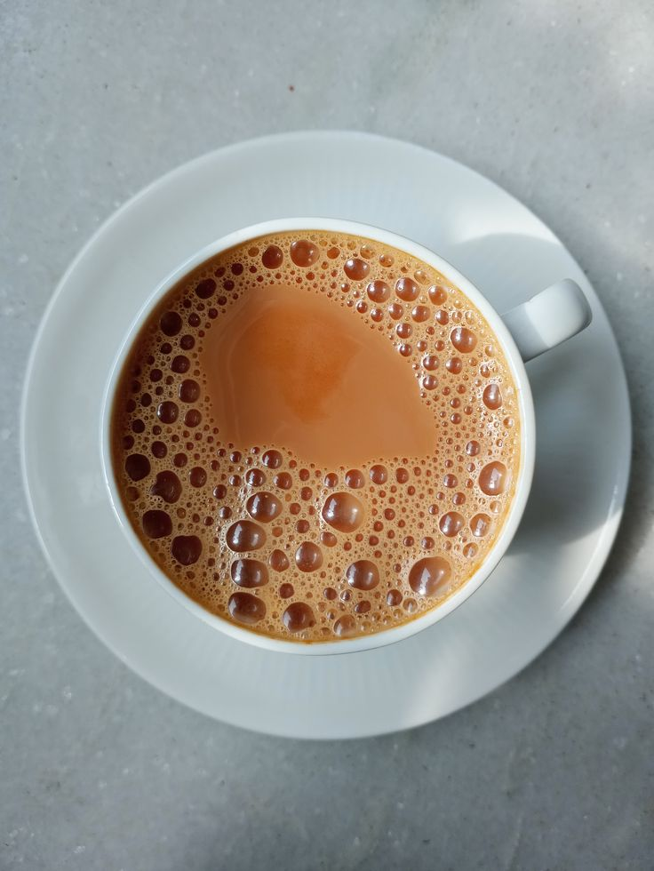


### How to

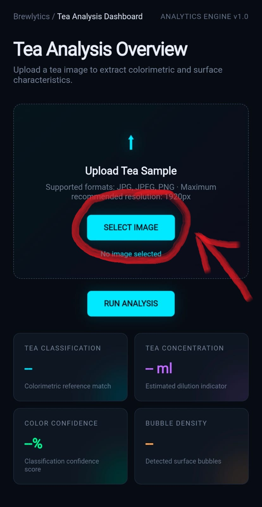
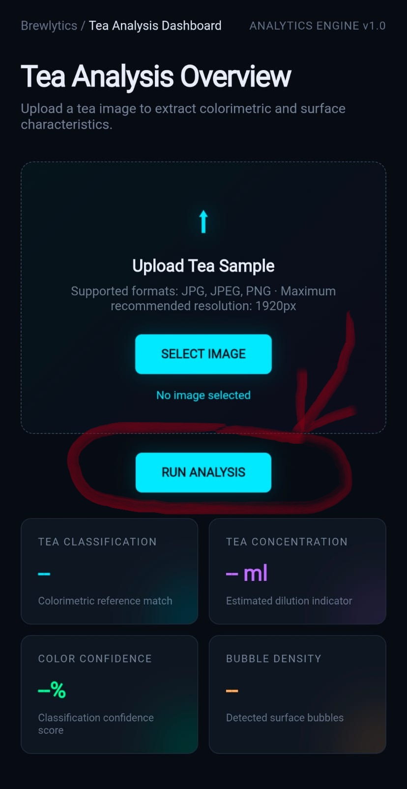

### Tea Analysis Dashboard

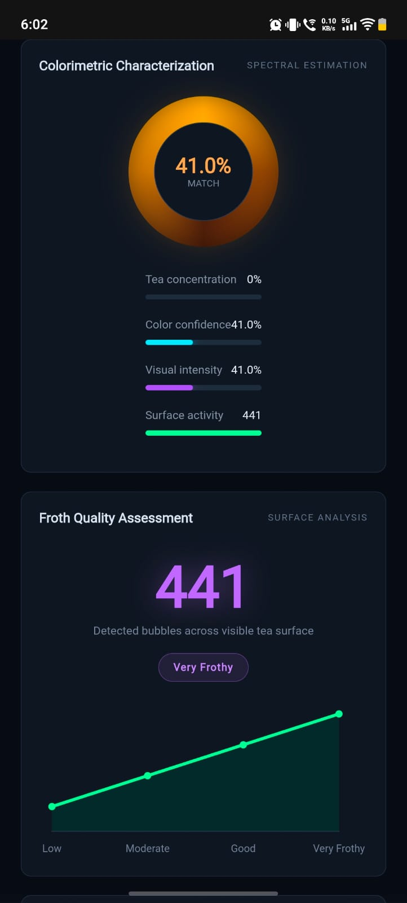
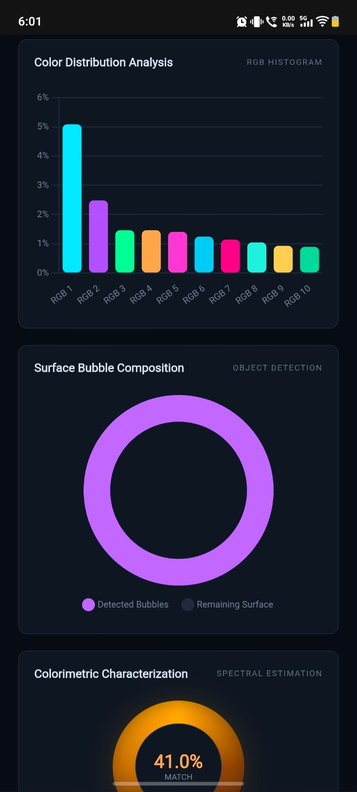
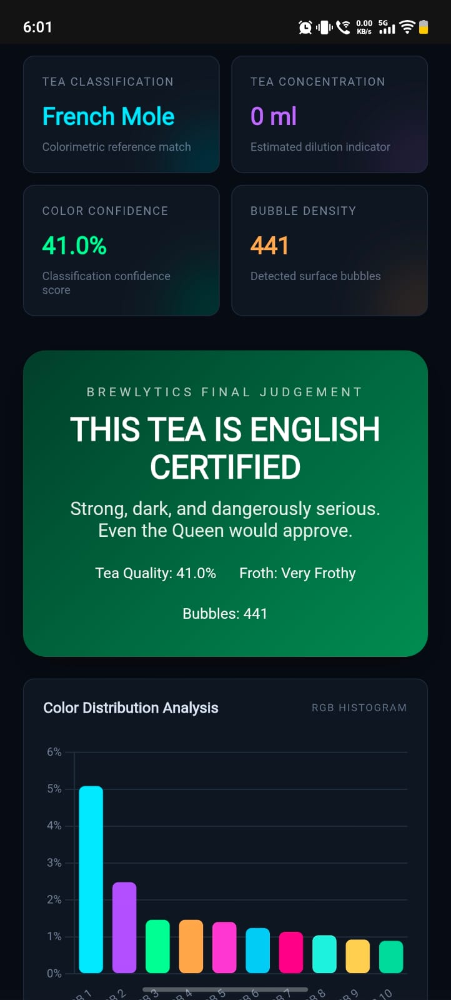

*The analysis dashboard displaying tea color metrics, concentration scores, and pointless graphical insights.*

### Final Tea Verdict

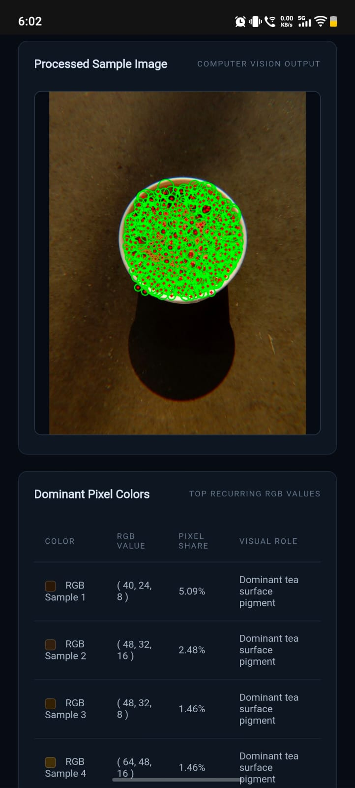

*The final tea evaluation featuring the overall score, tea personality, and unnecessarily harsh verdict.*

---
### Workflow

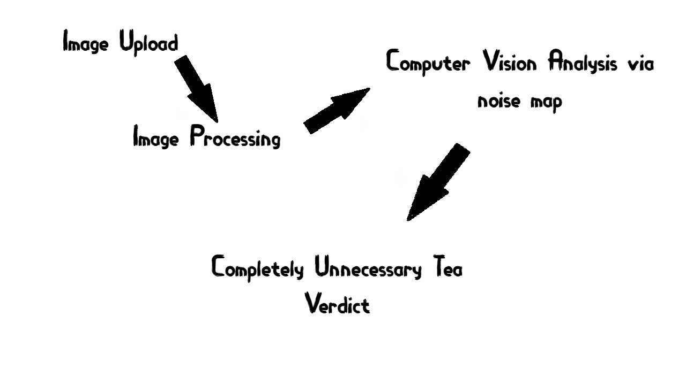

*Siplytics workflow: Image Upload → Image Processing → Computer Vision Analysis → Metric Calculation → Chart Generation → Completely Unnecessary Tea Verdict.*

## Noise Map View

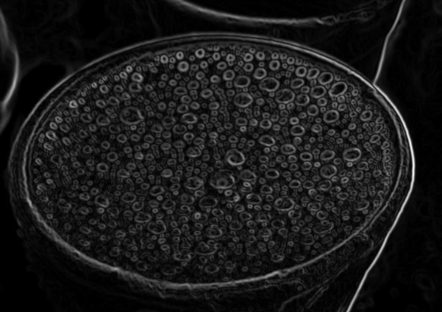

## Concentration Scale

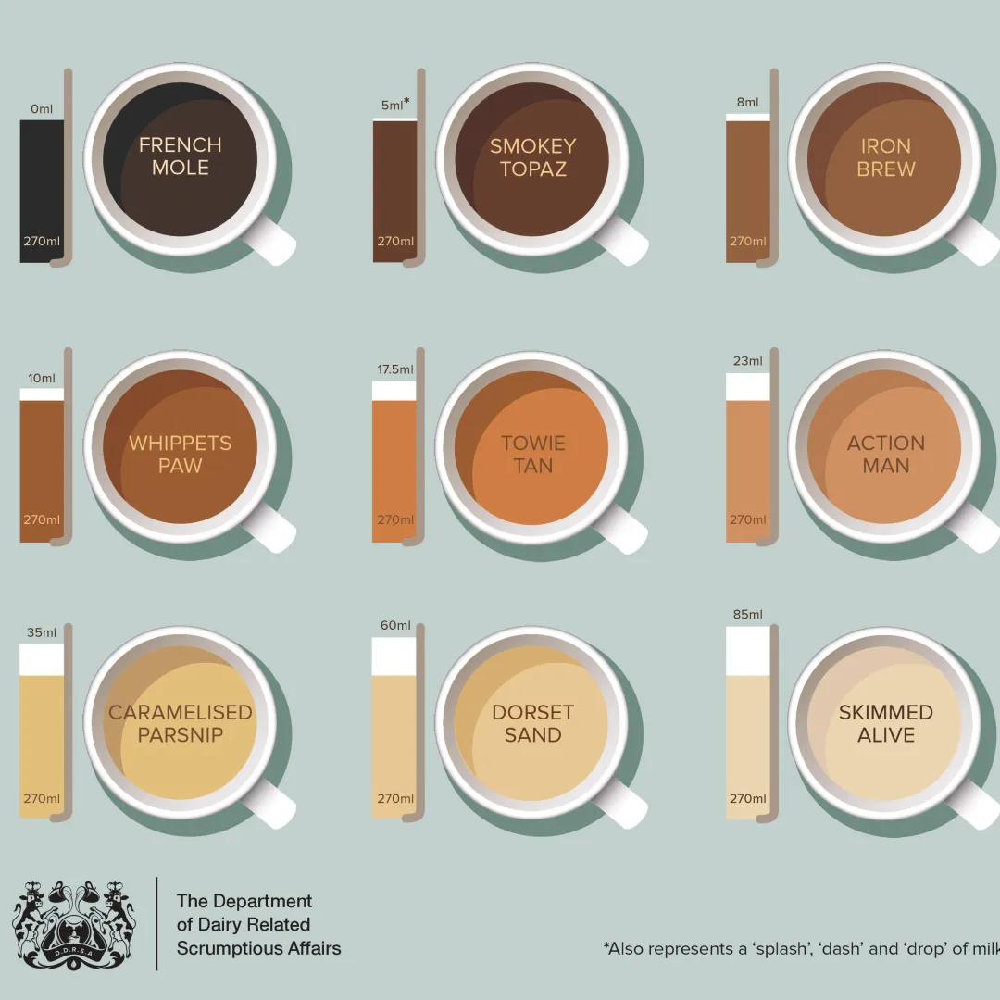

---

## Additional Demos

* Live application demonstration
* GitHub repository
* Source code walkthrough
* Tea comparison experiments

---

# Team Contributions

* **[ASI] Fariz Aiden S**

  * Designed and developed the Flask web application.
  * Implemented computer vision-based tea image analysis.
  * Developed image processing and tea concentration detection logic.
  * Created the dashboard interface and analysis visualizations.
  * Integrated the overall project architecture.

* **[CPO] Pavan K T**

  * Contributed to project ideation and concept development.
  * Assisted with UI/UX design and user experience.
  * Developed useless tea verdict logic and scoring concepts.
  * Assisted with testing and feature brainstorming.
  * Provided essential moral support during development.

---

## Future Scope

Since this project is intentionally useless, future improvements may include:

* AI-powered Tea Personality Detection
* Predicting Whether Your Tea Is Emotionally Stable
* Tea Horoscope Generation
* Quantum Froth Analysis
* Comparing Tea Against Other People's Tea
* Detecting Whether Tea Was Made by Your Mother or a Hostel Roommate
* Blockchain-Based Tea Authenticity Certificates

---

## Conclusion

Siplytics proves that not every technological innovation needs to solve a real-world problem.

Sometimes, all you need is a camera, Python, and an unreasonable amount of confidence in analyzing a cup of tea.

---

Made with ❤️ at TinkerHub Useless Projects


```
Tea analyzed.
Science performed.
Nothing accomplished.
```
